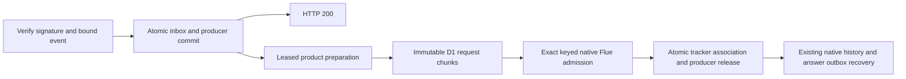

# Deployment

MoreHands deploys as a small control plane plus a separate coding runner.

```text
hatchery          Cloudflare Worker + Flue Durable Objects (hosts its own crons)
run-coding-task   Trigger.dev task that runs Pi + Agent Kits
```

MoreHands owns routes, run receipts, events, callback auth, and notifications. Trigger.dev hosts the
long-running coding task. The runner reports facts back to MoreHands; it does not own Linear, Slack,
merge, or production deploy authority.

## Prerequisites

- Node `>=22.18`.
- `npm ci`
- Cloudflare account + Wrangler auth.
- Trigger.dev project and secret key.
- `ZAI_API_KEY` for the Flue 2 Worker default, `zai/glm-5.3-flash`.
  The legacy `ZAI_CODING_API_KEY` is accepted as a migration alias.
- `OPENROUTER_API_KEY` for the separate Pi runner and any explicitly pinned OpenRouter model.
- Slack, Nango, Linear, and GitHub access for the workspace you are wiring.

## Cloudflare Setup

The dead-simple path is fill one file, run one command, then wire the external dashboards.

```bash
wrangler login
cp .env.deploy.example .env.deploy
$EDITOR .env.deploy
./scripts/setup.sh
```

`./scripts/setup.sh` is phaseable:

| Phase | Does |
|---|---|
| `resources` | creates D1 + KV if absent, writes ids into the env file (never into tracked `wrangler.jsonc`) |
| `migrate` | applies D1 migrations to `hatchery-skills` |
| `deploy` | builds Flue, patches the built config with the env file's resource ids, deploys `hatchery`, autofills `MOREHANDS_PUBLIC_URL` |
| `secrets` | pushes set values from `.env.deploy` to the Worker (derives `SLACK_BOT_ID` + `KNOWN_TEAM_IDS` from the bot token via auth.test) |
| `manifest [url]` | prints the Slack app manifest with the worker URL filled in, ready to paste (url defaults to `MOREHANDS_PUBLIC_URL`) |
| `doctor` | verifies the deployment leg by leg — config, worker liveness, Slack token, optional integrations — with the next step for each gap |

After you create/install the Slack app, add the Slack bot token to `.env.deploy` and rerun:

```bash
./scripts/setup.sh secrets
```

### Second account (e.g. work)

`MOREHANDS_ENV=<name>` points every phase at `.env.deploy.<name>`:

```bash
MOREHANDS_ENV=work ./scripts/setup.sh full
MOREHANDS_ENV=work ./scripts/setup.sh doctor
```

Account-specific resource ids stay in that env file; tracked files (`wrangler.jsonc`,
`trigger.config.ts`) keep the canonical instance's values, which CI continues to deploy.
A second Trigger.dev project is selected with `TRIGGER_PROJECT_REF` when running
`npm run trigger:deploy`.

## Worker Config

Everything account-specific lives in `.env.deploy` and is pushed as Worker secrets or vars.

| Secret / var | Worker | Required for |
|---|---|---|
| `ZAI_API_KEY` | hatchery | default `zai/glm-5.3-flash` model turns (legacy `ZAI_CODING_API_KEY` alias accepted) |
| `OPENROUTER_API_KEY` | hatchery | explicitly pinned OpenRouter model turns |
| `HEARTBEAT_TOKEN` | hatchery | guards the internal cron-fired routes |
| `SLACK_SIGNING_SECRET` | hatchery | `/slack/events` verification |
| `SLACK_BOT_TOKEN_DEFAULT` | hatchery | Slack replies |
| `KNOWN_TEAM_IDS` | hatchery | Slack auto-provision allowlist |
| `SLACK_BOT_ID` | hatchery | mention detection and auto-create |
| `ADMIN_CONNECTIONS_TOKEN` | hatchery | guarded admin routes |
| `NANGO_SECRET_KEY` | hatchery | connection sessions and token fetch |
| `NANGO_WEBHOOK_SECRET` | hatchery | `/nango/webhook` verification |
| `LINEAR_WEBHOOK_SECRET` | hatchery | `/linear/webhook` verification |
| `TRIGGER_SECRET_KEY` | hatchery | dispatch to Trigger.dev `run-coding-task` |
| `TRIGGER_API_URL` | hatchery | optional; defaults to `https://api.trigger.dev` |
| `AGENT_RUNNER_TOKEN` | hatchery | runner callback auth |
| `MOREHANDS_PUBLIC_URL` | hatchery | public callback origin for Trigger.dev |
| `RUNNER_GITHUB_PAT_TEMP` | hatchery | temporary dogfood GitHub token sent to the runner |
| `GITHUB_SELF_TOKEN` | hatchery | optional; capability-request issues on MoreHands's own repo (see Self-Improvement Loop) |
| `ROUTES_AUTO_ACTIVATE` | hatchery | optional; `true` auto-activates proposed agent-run routes (single-tenant dogfood — skips the admin counter-signature; repo allowlist still enforced). Leave unset for multi-tenant. |
| `WORKBENCH_RUNNER_TOKEN`, `CODING_RUNNER_URL` | hatchery | optional source-change workbench runner |

`RUNNER_GITHUB_PAT_TEMP` is a stopgap. Production should replace it with a GitHub App installation
token minted per repo/run.

## Flue 2 cutover

The production cutover completed on 2026-10-05, including controlled reopening.
See the [completion record](operations/2026-10-05-flue-cutover.md) and
[archived plans](superpowers/plans/archive/2026-10-05-flue-cutover/README.md).
Flue runtime/Vite remain pinned to `2.2.2` and Pi AI to `0.87.1`.

For subsequent production releases, CI uses the existing admission fence and preserves
live variables and container state. It stops if the remote migration check fails or
finds an unapplied migration. Migrations are reviewed and applied manually, in order,
with a backup; CI never applies them automatically.

```bash
npm run typecheck
npm test
MOREHANDS_BUILD_CUTOVER=fenced npm run build
npx tsx scripts/check-cutover-config.ts --mode fenced --runtime 2.2.2 --config dist/hatchery/wrangler.json
npx wrangler deploy --config dist/hatchery/wrangler.json --dry-run --containers-rollout=none
npx wrangler deploy --config dist/hatchery/wrangler.json --keep-vars --containers-rollout=none
```

A build without the fenced flag is for ordinary fresh-account setup, not the canonical
production release. Preserve `Project`, `FlueProjectAgent`, `FLUE_PROJECT_AGENT`, the
retired registry binding, and every historical migration tag. Do not delete/recreate
Durable Object classes or contact legacy storage with the native runtime.

When a release needs a drain, close admissions with compare-and-set, finish registered
producers, then collect fresh complete fleet, product and delivery observations. Unknown
coverage or unresolved delivery holds the gate. Reopen only under the authorized release
scope after those checks pass. HTTP 503 is rejection, not durable buffering; review
unadmitted provider events deliberately rather than guessing identities or replaying them.
After native activity, prefer a forward fix. A code rollback or D1 restore alone cannot
restore compatible Durable Object state.

The installed Slack manifest must register `morehands_reply` under top-level
`metadata.event_subscriptions`, preserving its real URLs, scopes and other registrations.
Verify it with a real trusted-bot post/history match. The checked-in manifest is a template.
Only `zai/glm-5.3-flash` is permitted for live cutover canaries.

Admin diagnostics use `ADMIN_CONNECTIONS_TOKEN` via `x-morehands-admin-token`, not heartbeat/runner
credentials. `GET /__admin/cutover/status` returns primary-bound D1 counts and separate informational
backlog. `POST /__admin/cutover/admissions` accepts only `{state,expectedRevision}` with compare-and-set;
400 means invalid, 409 stale, 503 unavailable. `POST /__admin/cutover/instance` accepts a reviewed
namespace/object/name/runtime association, derives the name's ID before object contact, and rejects
cross-generation or opaque unverified entries. It never calls setName or wake, but matching-runtime
startup may still run. No arbitrary-ID bypass is provided.

`POST /__admin/cutover/identities` accepts only `{namespaceId,instanceNames}` for the configured
namespace, with 1–100 distinct nonempty names of at most 1024 characters each (no edge whitespace
or control characters). It returns exact name-to-ID derivations using the bound namespace without
obtaining a stub or opening object storage. Historical unsuffixed names are permitted for derivation
only. A derived ID does **not** establish object existence, persisted runtime, generation, or idle
state; compare it with the independent full listing and retain unresolved runtime associations.
400 means invalid input/namespace, 503 unavailable, 200 a complete mapping with no partial results.

The offline report reads explicit local JSON only:

```bash
npx tsx scripts/cutover-report.ts --input ./evidence.json
```

Exit 0 means coverage-qualified `observed-idle`, 2 blocked/unknown, 1 invalid data. Submitted evidence
is not independently authenticated. **observed-idle is not deployment or rollback authorization**;
namespace listings and native/D1 reads are not an atomic fleet snapshot. Local physical-alarm canaries
prove natural idle cleanup/reconstruction only, not interrupted running-attempt recovery or production drain.

Flue's native history is the answer source. One isolated adapter reads pinned Flue 2.2.2
canonical records and admission metadata; upgrade it only with compatibility tests. Admission
metadata heals a lost dispatch receipt even before canonical input exists. An unclaimable native
submission with no canonical outcome closes visibly as failed, never with a fabricated answer.
The external outbox stores only delivery parts.
Engaged answers post below the working acknowledgement so a late progress edit cannot erase an answer.
The retired `FlueRegistry` class and binding remain inert without storage changes, preserving
the historical namespace. New posts cannot be claimed exactly-once. Slack history
access and returned message metadata are needed to reconcile a lost post response. No absence
of a history match is treated as proof that a post was never accepted.

## Durable Slack intake



Migration `0033_slack_ingress.sql` is additive and native only; it is applied in canonical
production. Fresh deployments must apply the ordered migrations before serving intake.
Absent tables cause verified Slack work to return 503; closed intake does not durably buffer new
work. Matching already committed duplicates remain recoverable while closed.

HTTP 200 means the verified event and its producer have committed. It does not mean preparation,
model execution, or answer delivery finished. Each lease holder uses SQL guards for product effects.
The transcript reuses migration0031's unique `messages.delivery_id`. File grants have a persisted
cursor so a later invocation can finish a bounded batch without losing ownership. Destination,
epoch, persona, and acknowledgement intent freeze before external effects; a ready request includes
the complete native message and context in at most twelve immutable BLOB chunks of at most
1,000,000 bytes each. Exact stored bytes and the original key are replayed after an unknown admission.
Native Flue remains the sole model execution, joining, and recovery engine.

The webhook and its background recovery share one conservative 50-statement invocation budget.
The scheduled handler shares that budget across all in-process reconciliation routes. It runs the
four recovery phases sequentially and rotates first access using the scheduled tick timestamp.
Whole-operation reservations protect readbacks and producer release before any effect; excess
records stay durable. Each phase receives first access once per four healthy two-minute ticks,
about eight minutes for an opportunity under saturation, without a backlog completion guarantee.
One ingress record can advance both phases when it fits; otherwise it retains ownership for a fresh
invocation. The existing two-minute cron is the recovery backstop. The private reconcile route accepts only
an empty JSON object under the heartbeat token, with no caller-supplied native request or key.
Preparation and handoff have separate capped backoff; eight unsuccessful claims retain a visible
obligation for explicit disposition. Exhaustion never grants permission to release a producer.

Acknowledgement `sending` or `uncertain` is repaired only by a unique positive history match with
matching delivery metadata and trusted bot/app identity. The lookup covers at most two pages,
bounded by the original event timestamp. Absence, unavailable history, duplicates, or mismatched
metadata keep the obligation uncertain. A positive Slack rate-limit rejection can retry after its
recorded delay; transport loss and 5xx do not permit a second post.

Retain referenced request bytes, native and uncertain work, and failed diagnostics. Quiet completion
removes the extra ingress event and file-checkpoint content while retaining its key/digest and status;
the normal product transcript and authorized file rows follow their existing retention. Abandoned,
unreferenced attempts may be removed only after 24 hours, checked integrity and live lease guards,
and atomic chunk-before-manifest deletion. Cleanup is bounded and resumable; it is not enabled as
a new automatic cron. Do not apply this policy to historical native evidence or reflection markers.

Native diagnostics additionally require `slackIngressPending`, `slackIngressFailed`,
`slackIngressAckUncertain`, and `slackIngressStorageInvalid`. Status hashes at most one outstanding
published request; larger outstanding coverage is explicitly unknown. Missing tables and unavailable
storage remain unknown. The old seven-counter product observation does not certify schema0033.
Accepted ingress still needs independent tracker, outbox, native fleet, and delivery observations.

The completed promotion included the full suite, actual emitted native image/ingress/crash
proofs, physical alarm canary, local D1 tests and an explicitly isolated remote D1 probe.
Remote acceptance trials stayed below Slack's three-second deadline, but measurements are
not a permanent capacity guarantee. Retained payload growth still needs operational capacity
review. See the completion record for measured sizes, headroom and memory limitations.

The reflection query now reads production `agent_runs`; the separately approved historical
reflection reconciliation is complete. Historical image obligations, installed Slack metadata,
live pixel recognition, fleet/product/delivery observations and controlled reopening received
independent disposition or positive verification before archival. Local tests or automated
completion feedback do not grant production approval.

## Trigger.dev Runner

The Trigger runner is configured by [trigger.config.ts](../trigger.config.ts). It packages:

- `git`
- `@earendil-works/pi-coding-agent` (+ capability extensions)
- `agent-kits/coding-default`

Deploys happen automatically: a push to `main` touching `trigger/**`, `trigger.config.ts`,
`agent-kits/**`, `package-lock.json`, or the runner workflow itself runs
[.github/workflows/deploy-runner.yml](../.github/workflows/deploy-runner.yml)
(gate: typecheck + tests, then the project's locked `trigger deploy` CLI).
Manual fallback: `npm run trigger:deploy`.

Set Trigger.dev environment variables for the task (dashboard → Environment Variables):

| Secret / var | Required for |
|---|---|
| `OPENROUTER_API_KEY` | all Pi model calls — kits route through OpenRouter |
| `KIT_ROOT` | optional override when packaged kit lookup differs |
| `MOREHANDS_PI_RUNTIME` | optional; `rpc` switches the pi channel, default is `cli` — runtime var, no redeploy needed |

The GitHub token and MoreHands callback token are sent in the dispatch payload by MoreHands. They do
not need to be standing Trigger.dev secrets.

### Agent kits

The dispatch payload's `kit` field (from the agent-run route config, default `coding-default`)
selects the execution path inside `run-coding-task`:

- `coding-default` — a single Pi agent, run-scoped branch `morehands/<slug>-<uuid8>`, regular PR.

Kit names are validated at route creation against `SUPPORTED_KITS` in `src/agent-runs/events.ts` —
unknown kits fail fast in the control plane instead of inside a Trigger run.

## CI Secrets (GitHub Actions)

| Secret | Workflow | Purpose |
|---|---|---|
| `CLOUDFLARE_API_TOKEN`, `CLOUDFLARE_ACCOUNT_ID` | `deploy.yml` | Worker deploy |
| `TRIGGER_ACCESS_TOKEN` | `deploy-runner.yml` | Trigger.dev personal access token for `trigger deploy` |

## Workspace Provider

Current M0 runner code uses a fresh local workspace inside the Trigger.dev task container. That is
acceptable only for dogfood against repos you control.

Use E2B, Vercel Sandbox, or another isolated workspace provider before running arbitrary third-party
repos. Trigger.dev is the task host; it is not the durable source of truth and should not be treated
as the safety boundary for untrusted repo execution.

```text
Git branch       code truth
MoreHands D1      run-state truth
Trigger.dev      long-running task host
Workspace        clone/edit/test filesystem
```

## External Dashboard Wiring

- Slack app event URL: `<worker-url>/slack/events`
- Slack slash command URL: `<worker-url>/slack/commands` (`/hands` — declared in
  `slack-app.manifest.json`; existing apps must re-apply the manifest to pick it up).
  `./scripts/setup.sh manifest` prints the paste-ready JSON with the worker URL filled in.
- Nango webhook URL: `<worker-url>/nango/webhook`
- Linear webhook URL: `<worker-url>/linear/webhook`

Curated providers ship hand-tuned API profiles; their Nango integration ids should use the catalog
slugs unless overridden in connection config:

```text
github
github-pat
linear
notion
```

**Any other integration enabled in the Nango project is also connectable** — no MoreHands change
needed. The agent validates the name live against `GET /integrations`, the auth webhook persists the
provider's API spec from Nango's catalog (base URL + required headers), and the call tool goes
direct for Bearer-auth providers or relays through Nango's proxy for exotic auth. Generic providers
default to `methodPolicy: get-post` (destructive verbs blocked); an operator can set
`methodPolicy: "all"` in the connection config to allow writes for one connection.

Linear should enable Issue events for `Run Agent` transitions. Comment events are needed for
continuation runs.

## Project Setup

After deploy:

1. Mention the bot in a Slack channel so the project/channel binding is created.
2. Ask the bot for setup status.
3. Connect GitHub and Linear through Nango from Slack.
4. Create a route with `propose_agent_route`. With `ROUTES_AUTO_ACTIVATE=true` (dogfood) it goes
   live immediately and step 5 is skipped; otherwise it is pending until an admin activates it:

```bash
curl -X POST \
  -H "x-morehands-admin-token: $ADMIN_CONNECTIONS_TOKEN" \
  "$MOREHANDS_PUBLIC_URL/__admin/agent-run-routes/<route-id>/activate"
```

Then move a Linear issue into the configured `Run Agent` state. The expected loop is:

```text
Linear state transition
  -> MoreHands agent_run + event receipt
  -> Trigger.dev run-coding-task
  -> Pi edits repo and opens/updates PR
  -> MoreHands callback
  -> Linear comment from MoreHands
```

The runner should report `pr_opened` when the PR is ready for review. Completion should come from a
real terminal signal such as PR merge, deploy, failure, or an explicit future policy decision.

## Self-Improvement Loop (capability requests)

Optional. Lets the agent turn "can you do X?" moments in Slack into GitHub issues on MoreHands's OWN
repo (the `file-capability-request` skill: offer → explicit human confirmation → dedupe against open
`capability-request` issues → file with the verbatim ask + requester + channel). The proposal queue
lives with the code, not in any tenant's tracker. Filing is human-gated per request; pickup is
human too — no automated dispatch from these issues yet.

Provisioning (three steps, no deploy):

1. **Credential** — a fine-grained GitHub PAT: repository access = ONLY the MoreHands repo,
   permissions = Issues read/write (Metadata read is implied). Narrow token, loose fence: the
   connection's `get-post` policy allows POST broadly, so the token's own scope is the guard.

```bash
npx wrangler secret put GITHUB_SELF_TOKEN
```

2. **Connection** — a `github-self` row for the channel, Worker-secret backend. `config.api` is a
   hand-set provider spec, so the generic dynamic profile serves it (direct Bearer calls, `get-post`
   default). Via the guarded admin route:

```bash
curl -X POST -H "x-morehands-admin-token: $ADMIN_CONNECTIONS_TOKEN" \
  -H "content-type: application/json" \
  "$MOREHANDS_PUBLIC_URL/__admin/connections" -d '{
    "projectId": "<channel-id>", "provider": "github-self",
    "tokenRef": "GITHUB_SELF_TOKEN",
    "config": { "repo": "<owner>/<repo>", "api": {
      "baseUrl": "https://api.github.com", "authMode": "OAUTH2",
      "headers": { "x-github-api-version": "2022-11-28", "accept": "application/vnd.github+json" } } }
  }'
```

3. **Skill** — `file-capability-request`, saved at `__global__` scope so every channel inherits it
   (a channel can override by name). Teach it in Slack and have the agent `save_skill` it, or seed
   the row directly.

The `github-self_call_api` tool appears the moment the secret exists — `connectionState` gates on
the env var, no deploy or restart. Related but separate: a tenant github connection can be opened
for writes on the PROJECT repos by setting `methodPolicy: "get-post"` in its connection config
(destructive verbs stay blocked; `"all"` is a deliberate per-connection operator decision).

### Durable Slack ingress disposable remote proof

Use the existing isolated worktree and an explicit fresh16-hex probe ID. The script has no production
resource default. `--prepare` only builds a minimal Worker and private ignored credential; review its
manifest before the explicitly authorized remote stages. The temporary Worker has one D1 binding,
no native/container/Slack/model bindings and no crons.

```bash
npm run test:d1-remote-ingress-storage -- --prepare <16hex-probe-id>
npm run test:d1-remote-ingress-storage -- --provision <absolute-manifest-path>
npm run test:d1-remote-ingress-storage -- --deploy <absolute-manifest-path>
npm run test:d1-remote-ingress-storage -- --run <absolute-manifest-path>
npm run test:d1-remote-ingress-storage -- --cleanup <absolute-manifest-path>
```

`--resume` repeats an interrupted `proof-running` run under the same ID. Deliberate corruption trials
stay failed closed across repeats. `--cleanup` is repeatable from `cleanup-requested`/`cleaned`, and
requires the saved successful readback hash. It deletes only the probe's rows and restores original
SQL guards atomically. State/results files are append-only. A recorded failed gate holds; interrupted
provisioning with an unknown creation receipt also holds for evidence-based inspection. Do not guess
ownership or edit a manifest to bypass a failed gate. Keep failed resources and evidence for review.

The script records signed acceptance latency separately from large-request store/load latency and
emitted statement counts. Capture Cloudflare memory quantiles and fresh DB size/headroom separately;
sampled memory is not an exact peak measurement. With referenced payloads retained indefinitely,
review retained-volume scenarios before opening production. Never run this capacity experiment
against `hatchery-skills` or substitute it for the native fleet/delivery and authorized flash canary gates.
