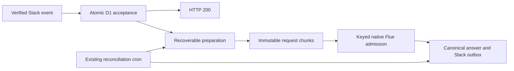

# Flue 2 production cutover — 2026-10-05

The gated MoreHands production cutover is complete. Native Flue 2.2.2 owns model
execution, joining, persisted history and recovery. Durable Slack intake commits the
verified event and producer ownership before HTTP 200, prepares under guarded leases,
and replays exactly the stored native request and key after an uncertain admission.

At completion, Worker `hatchery` served reviewed version
`d606bb86-e874-46cc-b0d9-394e8ad7f3ff` at 100%. Admissions reopened from closed
revision 15 to open revision 16. Producer count and all eleven product obligation
counters were zero. The cutover status endpoint reports `admissions open` while intake
is operational; it is a diagnostic for establishing a closed fence, not a health label.
These are time-bounded observations, not a continuing fleet certificate.

## Verification

- Independent implementation reviews and their fixes completed. The final publication
  suite passed 1,178 tests with zero failures; typecheck and native proof programs passed.
- Ordered D1 migrations through `0033` and the actual tables, indexes and guards were verified.
- Actual emitted native tests covered image projection, exact admission replay, process loss,
  joining, alarm recovery and uncertain delivery. Slack transcript deduplication uses the
  existing unique `messages.delivery_id`; no parallel effect-marker store was added.
- The complete stored fleet contained 29 objects: 17 matching native objects idle with no
  physical alarms, plus 12 legacy objects retained under reviewed retirement dispositions.
- All 20 stored Slack delivery parts matched a trusted bot and their exact delivery metadata.
  Eight genuine Slack events were accepted; seven retained requests passed route/key and
  whole/chunk digest checks, and one quiet event retained a tombstone.
- Repeated ingress/reply recovery changed no receipts, transcripts, posts or file grants.
- Genuine Slack pixel recognition and on-demand history lookup passed using only
  `zai/glm-5.3-flash`. Slack bursts settled as separate canonical turns because preparation
  delayed handoff. Separate background inputs proved a running native host and joined follower,
  followed by settlement without errors, alarms or top-level Slack narration. Local and trusted
  historical production evidence separately covered joined outbox delivery.
- An isolated remote D1 probe stored 20 requests near 11.5 MB each in twelve bounded chunks.
  Across 41 acceptance trials, the maximum measured acceptance latency was 350.7 ms.
  The conservative 500 MB headroom floor holds about 43 requests of the largest measured size.
  Sampled memory is not exact full-application peak memory, and retained payload growth needs
  continuing capacity review. Probe cleanup completed without touching production.

The reflection query now uses production `agent_runs`. The separately approved two-row
historical reflection reconciliation was completed once. Historical image obligations received
reviewed disposition. Legacy storage, namespaces, migration tags and container state were preserved.

## Operations and retained history

The [deployment runbook](../deployment.md#flue-2-cutover) describes release gates,
manual commands and admission controls. The main CI workflow builds with the production
fence, validates the generated configuration, preserves live vars and skips container rollout.
Remote migration-check failures stop deployment. Code rollback alone cannot restore compatible
Durable Object state.

Referenced request bytes, uncertain work and failed diagnostics remain retained. Quiet completion
tombstones extra ingress content. Guarded cleanup of abandoned unreferenced payloads is available
but is not a new automatic cron.

The [six archived plans](../superpowers/plans/archive/2026-10-05-flue-cutover/README.md)
retain their exact historical originals. Earlier planning-only statuses and deployment restrictions
are historical checkpoints superseded by later explicit human approvals. The human subsequently
requested publication after merging the migration branch.

Detailed approvals, failures, corrections, hashes, observations and the D1 backup remain in the
local ignored `.superpowers/archive/2026-10-05-flue-cutover/private-evidence.tar.gz` archive. Its manifest verifies each preserved record. Owner-only backup and admin credential copies remain in `.superpowers/private/`.
That private material is intentionally outside Git. This sanitized record is the public summary.
