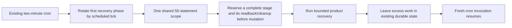

# Reconciliation query-budget adjustment

Status: human approved local implementation on 2026-10-05. Inline execution and the existing I1 fix pass are complete, with fresh local validation. Production and remote actions remain separately gated.

This supplements the approved durable-intake plan only for independent review finding I1. At review time, the populated-cron safety test failed: the counting wrapper observed legacy work but could not bound it. The reviewer reproduced 91 statements with 25 stale coding runs. A hard binding refusing statement51 also failed while retaining the Slack ingress identity, manifest, content and producer.

The approved plan says: “If either aggregate cannot fit, stop for reviewed budget/phase changes.” Its instruction to observe legacy routes without silently changing behavior is why this adjustment is presented before modifying their loops.

Recommended scope: retain one cron and the conservative50 statement bound. Execute the four existing recovery routes sequentially in a rotating order: agent-runs, replies, review-sweep and Slack ingress. Use the controller's scheduled timestamp (with an injected timestamp in fixtures), not a new database cursor or queue. For small backlogs all routes can still run in one tick. Under sustained saturation each phase receives first access once per four ticks, so fallback recovery may wait about eight minutes instead of the nominal two. Signed-webhook immediate preparation/handoff and native Flue alarms remain as implemented. Missed cron invocations do not provide a latency guarantee.

Add optional invocation-budget inputs to the existing product recovery loops and the internal route wrappers. Current constants stay upper ceilings; each invocation processes fewer records when the remaining budget cannot cover them. Do not release, fail, consume or repost a record just because budget is unavailable. Skip a phase before registering a drain/intake producer when its minimum safe stage cannot fit. A deliberate, normally completed bounded pass may release its own drain producer; the queued/tracker/outbox/ingress obligations remain visible. A real failure or ambiguous operation retains its producer as today.

Before any record mutation, native admission or external delivery, reserve a complete bounded operation, required primary readback after response loss, and route completion/deferral. Treat parallel coding dispatches as reserved allocations acquired synchronously before launching the promises; they cannot independently spend the same remaining statements. If a compound helper cannot fit below50 even alone, stop and split it only at an existing durable checkpoint after separate review. Do not rely on throwing at statement51 after a claim or external post.

Concrete touched paths are src/cloudflare.ts; src/slack/ingress-budget.ts; the four internal route wrappers in src/app.ts; src/agent-runs/dispatch.ts and notifications.ts; src/gateway/replies.ts; src/slack/reply-outbox.ts; and their budget tests. Review-sweep participates in the same scope and must reserve its current producer/watermark stages. Public calls outside the shared cron receive their own bounded invocation scope where necessary. Native Flue implementation/tables, keyed request identity, answer-outbox uncertainty, product failure rules, existing evidence and migrations are excluded from this adjustment.

Implementation sequence:

1. Retain the current failing populated-cron regression. Instrument the existing helper paths with the actual counted adapter and record each compound stage's maximum query cost, including errors and readbacks, before choosing reservations.
2. Add invocation-local reservation accounting and a hard pre-issue assertion as a backstop. Every batch statement consumes a slot. No process-global counter or fresh budget for in-process app.fetch calls.
3. Thread optional budget inputs through the named recovery loops. Stop before unreserved work. Preserve current behavior when a caller supplies no allocation, except that actual scheduled/shared paths must always supply it. Database unavailability must remain distinct from deliberate budget deferral.
4. Implement sequential rotated scheduled ordering and skip phases that cannot safely start. Keep existing token/fence checks and cron expressions.
5. Prove a hard50 binding never refuses a statement. Cover 25 stale/exhausted runs plus pending frozen ingress, populated running timeouts/notifications, reply parts/finalization, open review work, near-limit ingress, closure, lost responses and a concurrent coding dispatch allocation race. Across four fresh ticks each due phase gets a first opportunity; retained records resume without changing native key, losing ownership or reposting ambiguous Slack delivery.
6. Rerun typecheck, every registered suite, both emitted-native proofs, local binding probe as affected, then rebuild and guard the exact fenced artifact and perform deployment dry-run. Record fresh source/artifact hashes and the lead disposition of I1. This is completion of the existing single fix pass, not another independent review round.

The alternative is to revise the invocation bound after verifying an isolated target's actual applicable limits and every populated phase's upper cost. That evidence is absent; raising50 now is not recommended.

Human approval on 2026-10-05 covers this local recovery-budget adjustment. It grants no remote provisioning, migration, deployment, live canary, reopening, commit, push or archival authorization.

Implementation checkpoint, 2026-10-05: steps1–5 are implemented and targeted checks pass.
Reservations, nested stage shares and hard pre-issue accounting cover the actual scheduled scopes.
Coding token resolution uses the reserved operation DB, and parallel dispatches acquire allocations
before launching. Admission release slots are separate; background phase completion is awaited.
The existing record caps remain maxima. First-access rotation uses scheduledTime/120000 modulo4.
Each phase receives first access once per four healthy ticks; this is an opportunity to process
bounded work, not an eight-minute completion guarantee for arbitrarily large backlogs.

All targeted hard-binding tests preserve owned payloads/native keys and report no statement51
refusal. The original nine cron cases and three new populated/fairness/review cases pass;
reservation4, outbox18, recovery12 pass.

Step6 completed on 2026-10-05: typecheck, all80 registered suites (1167passed/0failed), emitted
native image and ingress proofs, physical native alarm canary, local D1 binding probe, final fenced
build/config guard, deployment dry-run with containers-rollout=none, and diff check all passed.
The wrapper fixture needed the new budget-helper export; its focused9/0 result and earlier failed
gate logs are retained. Fresh exact source/artifact hashes and preservation checks are recorded in
`reconciliation-budget-final-gates.json` and `reconciliation-budget-final-preservation.json`.
The existing single review fix pass is complete; no second reviewer was used. This adjustment plan
stays active with the cutover evidence. Actual remote D1 proof and all production gates remain open.
