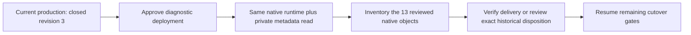

# Native submission inspection before production promotion

**Status:** The human approved this diagnostic stage on 2026-10-05. Deployment, the complete 13-object/16-submission inventory, trusted product correlation, and positive metadata verification of all 13 historical Slack replies are complete. No bare-user or image submissions required disposition. The subsequent reviewed main build removes the diagnostic helper. Production intake remains closed at revision 3 while the live canary destination and remaining reopening gates are pending. This plan stays active and unarchived until the complete cutover is verified. Evidence: `.superpowers/sdd/2026-10-01-flue-cutover-safety/production-cutover-completion/`.

## Why this stage exists

The user completed Cloudflare dashboard sign-in on 2026-10-05. Data Studio selected the correct namespace and the first known native object, but both schema enumeration and a direct `SELECT COUNT(*) FROM flue_agent_submissions` failed with `Invalid response format: missing or invalid result data.` No rows were returned. Searching by the verified name selects the same object ID; it does not expose a distinct name-based query option. The cause of the Data Studio response failure is unconfirmed. This diagnostic gathers the missing native inventory; it does not claim to repair Data Studio.

The existing admin observation gives counts and quiescence, but does not expose the exact historical submission IDs, input kinds or event correlation. Native settlement and zero product counters do not establish historical Slack image delivery.

## Concrete artifact and scope

Artifact directory: `.superpowers/sdd/2026-10-01-flue-cutover-safety/native-submission-inspection/`.

- `deployed-native/` preserves every module of the currently deployed `32e9a21e-acb7-452d-8291-a29b706c1bfa` byte-for-byte. `current-source-verification.json` records the fresh comparison before the deployment decision.
- `index.mjs` imports the original Worker and agent. It adds a subclass with one inspection method and wraps the Worker with one admin route. Native constructors, execution, joining, recovery, alarms and original handlers remain inherited.
- `read-only.mjs` accepts only a fixed operation, an allowlisted object ID, the expected fence revision and a bounded sequence cursor. It contains fixed, parameterized SELECTs. There is no arbitrary SQL or write operation.
- `wrangler.json` retains the existing Worker identity, namespaces, classes, historical migration tags, bindings, compatibility settings and cron settings. `current-runtime-verification.json` confirms the deployed compatibility date, flags and final migration tag match this configuration. Module rules include only the original deployed modules and the inspection helper. The local proof entry and fixture methods are excluded from the upload.
- Authentication is required in both the HTTP wrapper and the object method. The resolved token remains in memory; it is not stored or included in the identity/result. The method accepts only the 13 already-reviewed native names. The 12 older objects remain untouched.
- Each fence read uses its own fresh D1 `first-primary` session and requires closed intake, the same expected revision and zero producers. A normal open/close transition increments the revision twice and cannot return to revision 3. These observations are not an atomic fleet certificate or a claim that no temporary drain producer existed between them.
- The response contains bounded native IDs, timestamps, states, input kinds, attachment counts, envelope presence and candidate signal event IDs. It excludes raw text, payloads, media bytes, private URLs, native error details and credentials. Candidates require separate product-delivery verification. Missing historical correlation remains missing.

The original production app is retained in this diagnostic. The new durable-intake subsystem, migration0033 and reflection query change are not included. No model/Slack canary or reopening is part of this stage. No backward compatibility engine or storage conversion is introduced.

## Local verification and review

`local-proof-result.json` records18 actual captured native-class/SQLite checks under the production compatibility date. They cover positive metadata reads, unresolved bare image input, candidate signal correlation, private-field exclusion, 100-row pagination and full continuation, missing/wrong HTTP auth, direct object-method auth, foreign identity, arbitrary SQL rejection, body/UTF-8 bounds, open/stale/changed fence, stale-replica rejection, producers and unchanged public transport denial. Malformed native records remain explicit unknowns, never a fabricated mapping. Test fixtures seed terminal rows locally only, with model/Slack network calls forbidden.

One ZAI GLM-5.3-flash review through opencodex is preserved in `zai-review.md`; `review-disposition.md` records the authentication correction, monotonic-revision analysis and additional primary-routing RED/GREEN fix. Fenced configuration validation and a Worker-only dry run with `--containers-rollout=none` pass. The initial dry run's fixture inclusion was corrected before any deployment; all dry-run logs are retained.

## Authorized deployment after a diagnostic-stage ruling

Before deploying, recheck the artifact hashes, exact incumbent version, closed revision and absence of producers. Preserve existing Worker variables and secret bindings; do not extract credentials. Record the D1 recovery bookmark and the limits of recovering native object state. Keep container rollout disabled. Abort on any mismatch or failed gate.

Deploy only this reviewed diagnostic artifact with its named config. Re-read the version/bindings/fence, then request metadata pages for the exact 13 allowlisted associations. Require complete pagination, stable inventory endpoints and explicit unknowns before interpreting results. Join native submission/event candidates to existing product receipt/tracker/outbox records using trusted identities. Do not infer event IDs from thread timestamps or similarity.

If historical image delivery cannot be established, present the exact affected submission set for a human disposition. Do not replay, delete, force terminal state or mark Slack delivery complete. Only then resume the remaining main migration/deployment, installed metadata, flash-only live pixel, fleet/delivery and reopening gates. Preserve all evidence and active plans until verified completion.

The user's instruction, **“Stop on failed safety gates,”** is why this diagnostic-only deployment needs a separate ruling while the historical gate remains unverified. General cutover approval is not treated as permission to skip that gate.
