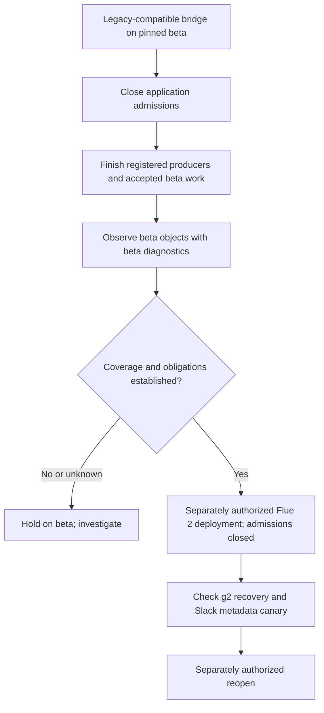
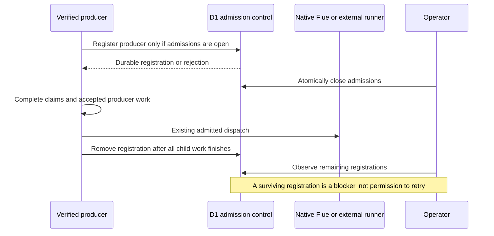

# Flue Cutover Safety

**Current status (2026-10-05):** Implemented, reviewed and verified in the completed [production cutover](../../operations/2026-10-05-flue-cutover.md). The matching execution plan is [archived](../plans/archive/2026-10-05-flue-cutover/README.md). Authorization statements and findings below describe the original design checkpoint; subsequent human approvals and completion supersede those statuses.

## Intent and authorization

Prepare a controlled beta-to-Flue-2 cutover without replacing native execution ownership. Stop new application admissions before consuming claims or watermarks, allow accepted work and external delivery to finish, and report the limits of drain evidence honestly.

The user approved local hardening and reviewed/approved this written design on 2026-10-01. This is not an approved implementation plan. No additional production mutation, push, deployment, migration application, real model call, or Slack post is authorized. The previously authorized channel model-pin change is complete and does not authorize other changes. Any later model canary must use only `zai/glm-5.3-flash`.

Keep `Project`, `FlueProjectAgent`, and `FLUE_PROJECT_AGENT`. Preserve namespaces, historical migration tags, product data, unrelated work, and the active host worktree. Never print, log, or commit credentials. Do not change the installed Slack app without separate authorization.

## Recommendation



Use a legacy-compatible bridge before replacing the deployed runtime. The bridge retains beta `1.0.0-beta.1`, its pinned dependencies, and the existing stream-journal patch. Its diagnostics must not be implemented by opening g1 objects through Flue 2.

Three approaches were considered:

1. **Bridge plus shared admission fence — recommended.** Extra local preparation, but old work stays under its owning runtime and race-prone producers are accounted for. No custom model retries or history store.
2. **Environment-only pause plus a quiet window.** Smaller change, but cannot establish that previously started asynchronous producers have finished. HTTP rejection alone is not lossless; providers have finite retry windows.
3. **Direct Flue 2 deployment after empty D1 counts.** Reject this: product counts omit native work and schedules, and `@g2` does not prevent g1 alarms under a replacement bundle.

The bridge requires a separate baseline-based change set. Do not restore beta dependencies or duplicate its execution implementation into the current native main tree. The exact deployed bundle must be tied to a verified source/dependency baseline before a bridge can be called compatible; deployment metadata alone is insufficient.

## Admission fence



Use one shared D1 control row and durable producer registrations. This fills an application-ingress gap; it is not an execution queue. Registration is an atomic `INSERT ... SELECT` conditioned on the control row being open. Closing admissions is an atomic update of that same row. Their database ordering determines whether an operation was admitted before closure. Do not read a flag and then insert separately.

Each registration records an opaque operation ID, source, runtime generation, and admission timestamp, not request content or credentials. Release it only after all associated producer promises finish, including work deferred with `waitUntil`. An admitted producer may finish after closure; the operator must wait for its registration to disappear. No expiry, automatic reclamation, or replay: an interrupted producer remains a visible blocker until investigated. A failed control read, missing required schema, or invalid control state fails closed without consuming work.

Use `CUTOVER_CONTROL=d1` to enable the shared fence. On an ordinary deployment only, an absent setting preserves existing behavior. Any nonempty value other than `d1` fails closed. Both bridge and fenced native deployment configurations require `d1`; their build/configuration checks reject its absence. With `d1` enabled, an absent database, control row, or required schema fails closed. No database error falls back to open.

Gate these producers before their first consuming side effect:

- Slack user events: after signature verification and URL challenge handling, before binding creation, target writes, KV claims, transcript writes, file actions, reactions, working acknowledgements, or dispatch.
- Linear transition/comment ingress: after authenticating the raw request, before run creation. Registration covers deferred runner dispatch as well as the response path.
- Internal scheduled and work-item requests: after existing authentication, before fire claims or work-item/run writes.
- Reminder scans: before `takeDueReminders`, which deletes one-shots and advances recurring reminders before returning.
- Reflection and review sweeps: before taking batches or advancing watermarks.
- Beta generic heartbeat and overhear admission paths: before dispatch; overhear work remains within its verified Slack producer registration.

Keep runner/source-change callbacks, connection callbacks, read-only slash commands, and delivery recovery available. Authentication failures keep their existing semantics; the fence must not grant diagnostic or admin authority.

A fenced request returns an explicit unavailable response before consuming application state. Do not acknowledge new work as successfully accepted. A `503`/`Retry-After` is not a durable buffer and does not promise eventual replay. Production procedure therefore requires a announced quiet window, suspension of upstream work creation, and operator review of rejected events before reopening. Lossless continuous ingress would require a separate durable buffering design; it is not silently added here.

The shared fence cannot account for requests or native producers running a pre-bridge bundle. Evidence that this older code can no longer admit work is a separate prerequisite. Waiting an arbitrary fixed delay does not establish that fact. A bridge deployment alone is not a cutover certificate.

## Accepted work versus new work

Closing intake must not abandon previously accepted native submissions or external delivery obligations. Native recovery and alarms continue under their matching runtime.

Existing queued coding runs may drain through the reconciler because they were already accepted. Their dispatch/reconciliation activity must be registered and visible to the cutover check; their durable run rows also remain blockers until terminal. A distinct internal drain registration is permitted while closed, but only for existing accepted-run recovery, never run creation. The production check requires those run rows and drain registrations to be settled together. New webhook/work-item run creation is fenced. Timeouts, callbacks, and notification delivery remain available. Native tools in accepted turns may create further work; native and product observations must include those obligations before cutover.

For beta, keep already parked messages visible and drain them through the existing beta path. `pending_messages` statuses and Slack receipts alone do not prove execution or posting success. Disable receipt-clock redispatch and epoch-reset behavior during cutover observation so it cannot race native ownership or silently replace a stuck turn. Do not reconstruct and re-admit a turn merely to force the counts to zero. An unresolved accepted obligation holds the cutover.

The plan must map every producer to its owner and account for registrations made by legitimate drain-only activity without allowing public intake through that exception. No generic bypass header.

## Version-specific observations

Provide authenticated diagnostics through the matching-runtime extension. Queries use raw bounded SQL counts and check schema/table presence before reading. They do not initialize tables, reconcile, claim, schedule, abort, or delete. However, contacting a Durable Object invokes its constructor/startup, which can perform normal native recovery. Disclose this distinction: the diagnostic body is observational; the entire object access is not guaranteed side-effect-free.

**Beta:** report all submission status counts, queued/running work, relevant attempt and deletion markers, native/SDK schedules, and the physical alarm. Beta Flue submission wakes are one-shot and stop rearming when idle. Let them fire and clear naturally under beta. Unknown callbacks, recurring schedules, or surviving alarms block the check; never delete them by assumption.

**Flue 2.2.2:** report all native statuses, including queued, running, terminalizing, joining, and joined; relevant unfinished SDK fiber/run records; schedules across relevant owners; and the physical alarm. Do not rely on a capped `listFibers` or runnable-only submission listing. Classify durable completed SDK records separately from unfinished execution. Reply-recovery wakes may finish naturally; unknown callbacks remain blockers.

Both reports include runtime/format identity, observation time, per-instance counts, and explicit `unknown` reasons. A missing table is not automatically an empty queue. Truncation is not zero. Do not call `__flueWakeAgentSubmissions` as a status API: it starts/reconciles work. Do not call `setName` to bootstrap an object merely for inspection.

Runtime routing must reject a mismatched generation before contacting the object. Generation alone is not enough for opaque Cloudflare IDs: an inventory entry needs a verified runtime association. Unknown stored objects remain unresolved rather than being opened through g2.

## Inventory and the meaning of idle

The existing bindings, conversation targets, beta registry, receipts, and parked-message rows are candidate sources, not a complete native-instance inventory. The Cloudflare object-list API returns paginated IDs and optional `hasStoredData`, not names, native queues, schedules, or a certified consistent fleet snapshot.

A local observation tool may accept an explicit inventory of object IDs/runtime associations and compare it with a separately obtained, fully paginated namespace listing. It must record coverage and unresolved objects, not claim that candidate IDs constitute the fleet. Obtaining that production listing or contacting production objects requires separate authorization. Treat missing runtime association, listing errors, pagination truncation, unclassified stored objects, and changing coverage as unknown.

Return `blocked`, `unknown`, or `observed-idle` for a stated coverage set. Never return an unconditional global `drained` or `safe-to-deploy` boolean. Observed idle means no recognized unfinished obligations were found in that timestamped, explicitly covered set. It does not establish upstream silence, old-bundle retirement, a consistent global snapshot, or rollback compatibility.

The production decision requires all of these separately: closed shared admission control; no outstanding producer registrations; evidence excluding pre-bridge producers; inventory coverage; matching-runtime native observations; and settled product/delivery obligations. Repeat observations after the last admitted producer completes. Repeated zero counts are supporting evidence, not a replacement for missing coverage.

## Slack metadata registration

Keep the established post/reconciliation contract: event type `morehands_reply`, payload key `delivery_id`. Add this top-level registration to `slack-app.manifest.json`, following the current official Slack example:

```json
{
  "metadata": {
    "event_subscriptions": [
      { "event_type": "morehands_reply", "schema": {} }
    ]
  }
}
```

This is outgoing schema registration, not a request to subscribe to incoming metadata events. Do not rename the event type, add unrelated events/scopes, or replace live URLs/configuration with repository placeholders. Prepare an additive patch for an app administrator to merge into the installed manifest. Available bot credentials cannot establish that installed configuration.

A local regression must link the declared event type to actual outbound metadata and positive exact-match reconciliation. Live manifest validation and metadata retention/readback remain production canary requirements. No metadata match means unresolved delivery, never permission to repost.

## Deployment and rollback boundaries

1. Build and test the baseline-compatible bridge locally; verify the deployment baseline and old dependency/patch identity. Keep the current Flue 2 tree separate.
2. With separate production authorization, back up D1 and apply reviewed additive migrations before the bridge requires its admission-control schema. Preserve ordered migration history; do not skip earlier pending migrations or hand-mark a direct SQL apply. Record the recovery boundary. D1 backup does not back up Durable Object execution state.
3. Separately authorize bridge deployment while maintaining a quiet window. Keep shared admission control initially closed, establish that pre-bridge producers have retired, and let accepted work finish under beta.
4. Gather inventory coverage, beta native observations, producer registrations, old parked-message evidence, coding-run state, and external delivery evidence. Hold on any blocked/unknown prerequisite. Do not abort, delete alarms, or clear data to manufacture idle. Review native code/schema compatibility against that same recorded boundary before advancing.
5. Deploy Flue 2 with admissions still closed and historical names/tags unchanged. Do not contact beta objects from the new runtime. Generation `@g2` changes future addressing only.
6. Validate the installed Slack manifest and run a separately authorized private-channel flash-only canary. Reopening is a separate controlled action, after evidence review.

Before any g2 admission, reverting to the verified bridge may be an option only if no incompatible object access or remaining cross-generation callback exists. After g2 admission, beta rollback is not a default escape hatch: g2 work, SDK schedules, producer registrations, and delivery obligations must be settled with g2-compatible code first, while g1 remains untouched. Unchanged Cloudflare migration tags do not prove format compatibility. Prefer a forward fix if those conditions cannot be established. Never restore D1 independently while native/runner work can still write against it.

## Verification requirements

Use failing tests before implementation. Required local cases:

- Closure versus registration ordering: no producer registers after closure, and registrations accepted earlier remain visible until their child work finishes.
- Database/control failures block before KV claims, D1 writes, acknowledgements, reminder deletion, and watermark advancement.
- Deferred Linear dispatch retains its registration; response completion alone does not release it.
- Fenced crons do not call consuming scans; callbacks, accepted-run recovery, read-only commands, and reply delivery remain available.
- Crashed producer registrations are not expired or replayed automatically.
- Every unfinished native state blocks idle; unknown format/table/callback, incomplete coverage, and truncated inventories report unknown.
- Runtime mismatch rejects before namespace access; diagnostic queries themselves perform no mutation or wake/abort calls.
- Beta wakes drain naturally in an actual pinned-runtime/SDK local canary; g2 reply/native wakes are observed under g2 only.
- Manifest registration matches actual outgoing metadata and exact reconciliation; unrelated manifest configuration stays unchanged.
- Full relevant suite, typecheck, build, generated-config inspection, and nonpublishing deploy dry-run for each runtime artifact.

Local tests prove ordering and interpretation, not deployed fleet quiescence. Production inventory, old-bundle retirement, installed Slack configuration, actual metadata readback, and rollback remain unverified until separately authorized checks establish them.

## Evidence

- Baseline commit `62beadc`: beta runtime/SDK/CLI `1.0.0-beta.1`, pinned Agents SDK `0.15.0`, existing journal patch; legacy entries `.flue/app.ts` and `.flue/cloudflare.ts`.
- Native migration commit `40fd12a`: Flue runtime/Vite `2.2.2`; current entries `src/app.ts`, `src/cloudflare.ts`, and `src/slack/reply-runtime.ts`.
- `@flue/runtime@2.2.2` generated constructor prepares stores before extension handling. Its legacy initializer accepts `schema_version=8`; cached beta stamps/checks `schema_version=1`. Settling beta does not upgrade that marker.
- Cached beta runtime and baseline Agents SDK source show submission wakes stop rearming when idle and completed one-shot schedules are removed naturally. These are source findings, not production observations.
- Slack official metadata documentation: https://docs.slack.dev/messaging/message-metadata/ — registration required; documented top-level `metadata.event_subscriptions` with `schema: {}`.
- Cloudflare object-list documentation: https://developers.cloudflare.com/api/resources/durable_objects/subresources/namespaces/subresources/objects/methods/list/ — paginated object IDs/storage indicators, not native drain state.
