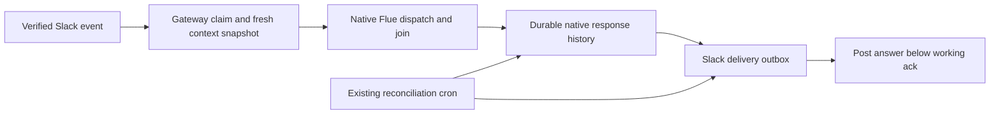

# Flue Native Migration

**Current status (2026-10-05):** Implemented, reviewed and verified in the completed [production cutover](../../operations/2026-10-05-flue-cutover.md). The matching execution plan is [archived](../plans/archive/2026-10-05-flue-cutover/README.md). Authorization statements and findings below describe the original design checkpoint; subsequent human approvals and completion supersede those statuses.

## Intent and constraints

Implement the completed Flue 2 spike in production code and merge locally. Prefer native Flue facilities over framework-gap code. Preserve product behavior and safety boundaries. No push, deployment, production data mutation, or real Slack posts are authorized by this implementation request. Any real model canary uses only `zai/glm-5.3-flash`.

Pin Flue runtime and Vite plugin to `2.2.2`, Pi AI to `0.87.1`. Keep `Project`, `FlueProjectAgent`, and `FLUE_PROJECT_AGENT` names. No Sandbox/MCP upgrades or debounce subsystem.

## Architecture

Flue owns dispatch idempotency, active-response joining, conversation history, execution retries, and stream persistence. Application code retains signature verification, pre-dispatch side-effect claims, project/provider/file authorization, activity UX, cron scheduling, and external delivery bookkeeping.

The synchronous `Project` function consumes trusted serializable context supplied by the gateway in signal attributes and first-instance data. Loading context before dispatch avoids the one-delivery lag of async start hooks. Context contains binding metadata, persona, skills, memory, and connection specifications, never secret values or functions. Tools resolve credentials from the current isolate environment at the network boundary.

Tools use native Valibot `input` and `run({data})`. Existing operation-specific timeout races remain where they produce audited failure results; replacing them with a tool-envelope timeout would otherwise bypass those product contracts. Native observations replace custom logging/reminder wrappers. The obsolete journal patch and patch-package are removed.

## Answer delivery

For engaged conversation requests, ordinary final assistant text is the answer. The reply tool is not required and is not mounted for that mode. Collect all completed assistant steps without tool calls from the same settled response; never keep only the last step, and never publish reasoning or intermediate tool-call narration. Joined submissions share one response identity.

Capture must recover from native persisted history after process loss. Observer events are wake-up hints, not the only answer source. Track admitted conversation instances durably before dispatch, so a missed finish observer can be recovered by the existing cron. Stage a response only after authoritative settlement. Outbox identity combines instance, stable native response identity, and chunk index. Replaying capture must not create new rows or change already-staged text.

Stage all formatted Slack chunks atomically in one SQL statement. Claims use compare-and-swap leases. Deliver chunks in order. `chat.update` of a known acknowledgement timestamp can repeat safely after an interrupted request. A fresh post carries delivery metadata. An expired fresh-post claim or transport failure becomes `uncertain`: search Slack history for that exact metadata, never infer acceptance from matching text. A positive match marks it sent. No match or missing history permissions leaves it unresolved rather than blindly posting again. This does not promise exactly-once external posting.

Quiet background/reflection/review turns do not automatically publish final narration. Their existing explicitly gated posting tools retain product intent and budgets. An empty engaged answer cannot be treated as successful delivery; retain a visible failure or retry outcome.

Activity receipts must not overwrite the final answer. The selected acknowledgement is trusted gateway state, not model-supplied routing. Completed delivery writes transcript evidence once through a stable deduplication key or a transactional ledger seam.

## Cutover

Keep the Durable Object class name and bump the existing instance-generation constant from 1 to 2 to start fresh Flue state. Do not delete/recreate the agent class using the unproven two-tag reset. Keep historical migration tags unchanged. Preserve the retired registry namespace with an inert exported class and binding, with no storage mutation. D1 product data survives; native conversation state cold-starts using existing Slack/D1 context.

Remove the six-hour generic heartbeat and manual route, not reminder/reflection/review clocks. Keep the internal-route token. Unknown cron expressions do nothing. Do not drop the pending-message table while old admitted messages may remain: document drained cutover and retain data until separately authorized cleanup.

## Verification

Baseline restored dependencies: existing typecheck, full tests, and build passed before migration.

Required checks: native schema/tool tests; current first-render context and secret-exclusion tests; assistant-only observation and settlement tests; joined-step answer coverage; repeated capture; missed observer/restart recovery; ack-edit replay; accepted-post/response-loss reconciliation; unresolved post no-retry; concurrent delivery claims; multi-chunk ordering; quiet background no-post; full typecheck/tests/build; generated-config review and deploy dry-run. Local fake-Slack/crash tests do not establish real Slack permissions or production platform migration success. Record skipped canaries honestly.

Implementation evidence: native dispatch/model-generation canaries exercise admission deduplication,
busy joining with both no-tool finals, transient provider retry, exact receipt closure, and capture
from a fresh generated instance after all settlement wakes are lost. They use a local Pi faux
provider and mocked Slack, with installed Flue runtime and SQLite. A cross-attempt process-crash
canary was not established; retained checkpoints across attempts are covered by native projection
and source checks, not a claim of production crash proof. Cloudflare cutover and real Slack
metadata/history permissions still require a separately authorized canary.
