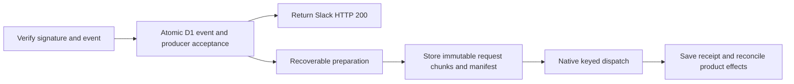

# Durable Slack Intake Design

**Current status (2026-10-05):** Implemented, reviewed and verified in the completed [production cutover](../../operations/2026-10-05-flue-cutover.md). The matching execution plan is [archived](../plans/archive/2026-10-05-flue-cutover/README.md). Authorization statements and findings below describe the original design checkpoint; subsequent human approvals and completion supersede those statuses.

**Status:** Human approved the design for planning, then the reviewed implementation plan and local inline execution on 2026-10-04. Production migration/deployment/reopening and isolated target provisioning remain separately gated. This document does not waive existing cutover gates. The two named reflection markers were reconciled under separate exact-scope human approval; see the audit below.

**Goal:** A verified Slack event receives HTTP 200 only after durable application acceptance. Preparation survives interruption, and uncertain native admission retries reuse exactly the original request. Native Flue remains the only model execution, joining and recovery engine.

## Proposed flow

The new component owns transport acceptance and preparation, not model turns. It must not override native alarms, directly insert native submissions, replace canonical history, or build another agent scheduler.

## Evidence and limits

Pinned Flue 2.2.2 supports top-level `dispatch(Project, request)` with `idempotencyKey`. Matching replay returns the original receipt. The comparison includes target, message with hydrated attachments, and `initialData`; server tracing and acceptance timestamps are excluded. Changed input conflicts, and a terminal failed submission remains failed. A reused `init()` handle can omit `initialData` after successful contact, so replay must use top-level dispatch.

The existing gateway loads mutable context/media before dispatch. Repeating preparation under the same key is not safe replay. The existing KV claim is not durable acceptance. SDK `queue()` persists tasks before returning but removes them even after exhausted failures; it does not by itself establish retained failure or restart recovery. `waitUntil` may accelerate work but is never its durable owner.

Current local native capacity evidence permits an application request up to 11,500,000 encoded bytes, including transport reserve; it is not universal HTTP capacity evidence.

Official D1 limits checked on 2026-10-04 specify 2,000,000 bytes per string/BLOB/row, 100,000 bytes of SQL per statement, 100 bound parameters, and 50 queries per Free invocation or 1,000 per Paid invocation. Batch statements are transactional and a statement error rolls back the batch. A successful conditional no-op is not an error and must be inspected explicitly. These facts do not prove latency or capacity for this application.

**Proposed storage choice:** use bounded D1 BLOB chunks, not a single large value and not a new R2/Queue binding. This reuses the existing product database and permits atomic manifest/ownership transitions. It is provisional until deployed-size and binding serialization tests pass. A failed capacity or latency gate requires revising the design before implementation/deployment, not silently adding infrastructure.

## Boundaries

- Only verified Slack events enter this inbox; public callers cannot choose native target, generation, drain type, or trusted snapshot.
- URL verification remains a non-work response after applicable authentication.
- Event identity is scoped by trusted Slack account/team plus provider event ID. Retain a digest of the verified original bytes to detect conflicting reuse. Do not accept changed input under the old event ID.
- Known duplicate durable events return acceptance even when the fence is closed: this creates no new work. A genuinely new event while closed remains rejected and is not silently parked.
- Freeze routing, agent slug, epoch and target before request readiness. Loading these values and committing the chosen route must be race-tested against binding changes and epoch reset.
- No resolved token, authorization header, private download URL, or model credential may enter durable prepared storage. Store only required input, safe file IDs/handles and opaque token-reference names. Strip private URL fields from retained Slack payloads; keep original digest separately.
- Inbox data contains private product content. Define retention and deletion policy before rollout. No content/credential logging.

## Durable records

An additive migration introduces application-owned ingress, request-manifest and chunk tables. Existing historical migration files remain unchanged.

### Ingress

Fields include trusted provider identity, original digest, sanitized event, generation, producer ID, route/epoch, state, revision, preparation lease owner/expiry, request-manifest ID, native receipt association, safe failure category, and timestamps.

States are `received`, `preparing`, `ready`, `uncertain`, `accepted`, and `failed`. Duplicate/conflict and retry outcomes are visible; terminal failure never masquerades as success. A failure record continues to block operational completion until positively resolved or explicitly dispositioned.

Raw webhook storage needs a measured size bound, independent of native request size. A size rejection occurs before acceptance, uses safe diagnostics, and never sends HTTP 200. The final bound must be chosen from actual valid event fixtures and platform limits rather than assumed from this draft.

### Frozen request manifest

Fields include immutable target/key, encoding version, total byte length, ordered chunk count, complete SHA-256 digest, and readiness. The serialized request preserves envelope strings, snapshot, initialData, acknowledgment timestamp, attachment order/MIME/name/data, omission choices and key. It must not refresh any of them on replay.

A preparation attempt uses an independent identifier. Only the current lease/revision owner may publish its manifest. Losing preparers can leave unreferenced attempts but can never dispatch them.

### Request chunks

Proposed chunk size is at most 1,000,000 bytes, leaving margin under the 2,000,000-byte row/value limit. A near-limit request requires approximately twelve chunks. Use bound BLOB values rather than interpolated SQL/base64 chunk values. Each chunk has manifest/attempt ID, ordinal, byte length and digest.

The implementation must prove all UTF-8 byte boundaries reconstruct exactly, including non-ASCII context; chunks are bytes, not independently decoded strings. Reassembly verifies ordered completeness, lengths and hashes before JSON parsing and dispatch. Missing/corrupt storage fails closed.

## Acceptance transaction

After signature and minimal event validation, atomically create the unique ingress record and its cutover producer registration under the current open control row. Both writes must select the same proposed producer identity and generation. A duplicate must recover the existing record, not create another producer.

The D1 batch must distinguish: accepted new event, matching already-accepted event, closed new event, and conflicting event identity. Inspect changes and read back primary-bound identity/state before claiming acceptance. SQL statement error rolls back; zero changes alone does not prove either acceptance or failure. Race tests must prove there is no event without ownership or leaked duplicate producer.

Return 200 only after durable acceptance is established. No thread/channel history, acknowledgment post, image download, model context, or native dispatch is required before this response. A commit timeout is ambiguous: Slack retry recovers the same durable event; never mint a new identity or erase a claim to force progress.

## Preparation and immutable publication

A primary-bound CAS claim selects received/expired-preparing work and issues a lease owner plus revision. Lease expiry permits another preparation attempt; it does not authorize dispatch of an earlier unpublished attempt. All state transitions check owner/revision.

Preparation reuses existing authorization, bounded history selection, capability routing and media validation. Split preparation from dispatch so preparing a request never contacts native admission.

Working Slack acknowledgment is an external effect. Persist intent before posting and distinguish posted from ambiguous. If its response is lost, inspect positive evidence using a supported identifier or remain visibly uncertain; do not post another acknowledgment blindly. This design must preserve engagement and answer-thread semantics rather than simply dropping acknowledgments to simplify retries.

Write and verify attempt chunks first. Commit immutable manifest/readiness and ingress `ready` state under the preparation lease/revision. **No native dispatch before that commit.** A lost readiness response is resolved from storage before continuing.

A prepared request is read exclusively from its ready manifest. Refreshing personality/history/media during native replay is prohibited. A separately requested new user turn receives its own key and fresh preparation.

## Native handoff and recovery

Dispatch through top-level supported `dispatch(Project, frozenRequest)`. Concurrent exact replay is permitted only once native pinned tests establish convergence; a CAS handoff lease reduces competing sends but cannot prove an interrupted send was rejected.

- Receipt returned: persist original submission ID/UID/accepted timestamp with the event association and initialize existing delivery recovery idempotently.
- Transport result unknown: retain `uncertain`; retry exact stored request and key, never rerun preparation.
- Identity conflict: retain visible failure; no replacement key, edited payload, or blind success claim.
- Native terminal failure: existing failure rules apply; exact replay is not an execution restart.

Receipt persistence, reply-tracker creation and application ownership release must be recoverable together. Do not release the ingress producer merely because a receipt was returned while required product effects remain unrecorded. Native execution and Slack answer delivery remain owned by native history and the existing uncertainty-aware outbox.

Use the existing product cron/reconciliation path as a durable backstop with bounded work per invocation. `waitUntil` may invoke it promptly after acceptance; a failed/lost invocation must leave the original durable state available for the next scan. Accepted inbox work may drain while intake is closed under its original ownership; it must not reenter the new-intake gate.

Extend cutover observation to count inbox states, frozen-request corruption, unresolved acknowledgments and retained producer ownership. Accepted/terminal archival eligibility requires evidence, not age-based expiry.

## Storage lifecycle

Retain immutable bytes while native acceptance is unknown or an association is incomplete. A grace-period cleanup reconciles manifests, references, ingress states and outstanding leases before deleting unreferenced attempts. Time alone never licenses deletion of a referenced uncertain request.

After positive native association and completed product handoff, retention may remove attachment/request bytes under a reviewed privacy policy while keeping safe audit identity and digest. A request whose bytes were removed cannot later be exactly replayed; recovery must use established native receipt/history, not rebuild it.

## Required tests before promotion

1. Real SQLite schema and signed ingress: new acceptance atomically owns producer; duplicate/conflict/closed-fence races; ambiguous commit followed by matching retry.
2. HTTP path: no history/ack/media/native calls before acceptance; slow preparation cannot delay webhook response after commit. Measure latency separately; do not claim an unconditional three-second bound.
3. Preparation crash at every storage transition: lease/revision prevents stale publication or dispatch; restart/backstop resumes durable work.
4. Native keyed replay: fresh instance and existing instance, lost receipt, concurrent exact replay, attachment hydration, changed initialData, and failed submission. Assert one native admission/execution, not only a mocked dispatch call.
5. Acknowledgment response loss and recovery: no duplicate external post, preserved destination and answer-thread semantics.
6. Frozen large request: near 11.5MB, twelve chunks, actual Cloudflare D1 BLOB serialization/capacity, Unicode splits, missing/corrupt/reordered chunks, memory and query budgets. Local SQLite alone is not a remote D1 capacity certificate.
7. Cutover: close during preparation/uncertain handoff; accepted work drains under ownership; failures remain blocking; new intake rejected; no native alarm override.
8. Privacy/cleanup: no resolved credentials/private download URLs; no deletion of referenced uncertain payload; safe orphan recovery.
9. Existing image/native/Slack suites, typecheck, actual emitted proof, fenced build/guard and dry-run remain green. Any proof that rebuilds ordinary config must precede the final fenced build.

## Separate operational work

The two reflection registrations were separately approved for exact reconciliation as failed before batch consumption, accepting missing historical per-invocation traces. Guarded mutation removed exactly those two rows; readback retained closed revision 3, producer count 0 and all seven product obligation counts 0. No replay, watermark change or reopening occurred. Evidence: `.superpowers/sdd/2026-10-01-flue-cutover-safety/approved-reflection-reconciliation-audit.json` and its before/mutation/after references. This product observation is not native fleet or deployment authorization. The missing reflection table reference still requires a separately reviewed bounded fix with a failing real-schema regression.

Historical bare-image admissions without trusted event mapping remain operational obligations. Do not manufacture event IDs, answered status or new deliveries. Installed Slack metadata, real flash-only image recognition, final inventory and controlled reopen remain production gates.

## Approval and execution

Human review approved this architectural design for planning on 2026-10-04. Plan review and execution selection still precede product edits. Any production schema/storage probe, marker reconciliation, deployment, canary or reopening needs the applicable authorization and safety evidence. Never push. Archive completed plans only after verified operational completion.

## Sources

- https://developers.cloudflare.com/d1/platform/limits/
- https://developers.cloudflare.com/d1/worker-api/d1-database/
- Installed Flue public types `dist/types-B1PuLhZt.d.mts:287–345`.
- Installed native keyed comparison `dist/conversation-stream-store-2-jUriih.mjs:4950–4989`.
- Installed handle behavior `dist/index.mjs:55–73`.
- Installed Cloudflare extension/scheduling guide `docs/guide/cloudflare-target.md:110–118,214–252`.
- Installed pinned Agents queue `node_modules/@flue/vite/node_modules/agents/dist/index.js:1595–1672`.
- `docs/superpowers/specs/2026-10-04-slack-image-input-design.md:133–149`.
- Cutover evidence: `.superpowers/sdd/2026-10-01-flue-cutover-safety/native-ingress-seam-findings.json`, `current-reflection-reconciliation-proposal.json`, and `progress.md`.

## Execution approval record

The later human “Approve” authorizes local execution of the reviewed plan at SHA256
`a6dd0f90df8a8bc670b782ff738e6567d3ffc15cfee8d2402e5666a7c246766e`, including its narrower
quiet-ingress extra-copy retention. This supersedes the earlier planning-only implementation limit;
it does not waive production gates or authorize plan archival. The append-only cutover ledger
records local implementation, verification failures and subsequent repairs separately.
