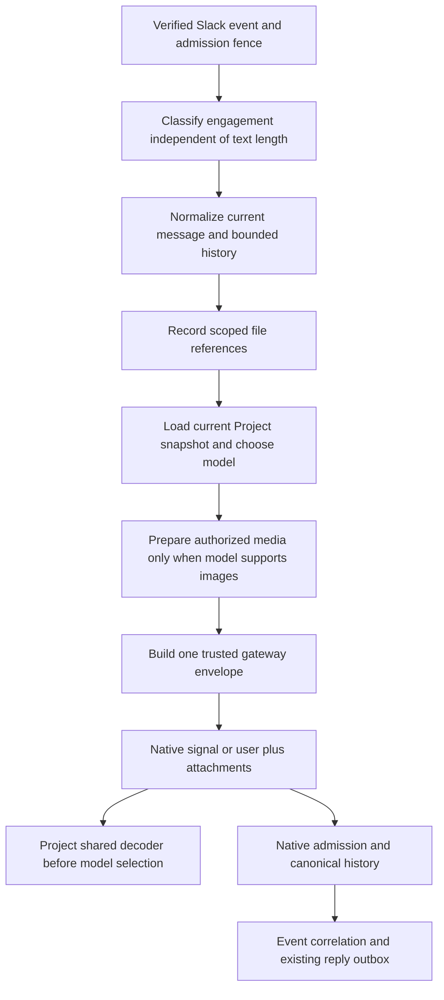

# Slack Image Input Repair

**Current status (2026-10-05):** Implemented, reviewed and verified in the completed [production cutover](../../operations/2026-10-05-flue-cutover.md). The matching execution plan is [archived](../plans/archive/2026-10-05-flue-cutover/README.md). Authorization statements and findings below describe the original design checkpoint; subsequent human approvals and completion supersede those statuses.

Status: user approved local planning on 2026-10-04. Native source findings are incorporated below; the implementation plan still requires review and execution authorization. No implementation or production action is authorized by this document. This is not a production cutover certificate.

## Goal and constraints

An image should add native model content without changing whether a turn is engaged, which project configuration it uses, where progress/final replies go, or whether its final answer can recover after receipt loss. Images sent separately must remain discoverable within bounded, authorized conversation history.

Keep native Flue 2.2.2 responsible for admission, persistence, joining, execution, and recovery. Keep the existing Slack uncertainty-aware outbox responsible for external final delivery. Do not add a second agent runtime, model queue, receipt-clock redispatch, or custom execution retry. Preserve `Project`, `FlueProjectAgent`, `FLUE_PROJECT_AGENT`, dependency pins, unrelated changes, and existing plans/evidence.

All implementation verification would be local, with fake Slack responses, valid image fixtures, and a stub provider. No real model calls, real Slack posts, remote state reads/writes, deployment, migration application, commits, pushes, or plan archival are permitted by this draft. A separately authorized live canary must use only `zai/glm-5.3-flash`. Credentials stay in Worker environment bindings; neither model content nor diagnostics may contain their resolved values.

## Root causes and evidence

The current producer switches engaged image turns from a signal to a user delivery (`src/gateway/dispatch-message.ts:24`). Project only reads product input and the current trusted snapshot from signals (`src/agent/project.ts:51–64`). Consequently an image turn becomes autonomous, loses conversation/ack metadata, and uses creation-time context. Receipt-independent recovery reads event IDs only from signal attributes (`src/slack/delivery.ts:79–81`); canonical user input can only find a tracker whose submission receipt was already attached (`src/slack/delivery.ts:148–151`).

Slack ingress additionally drops image-only DMs, removes images from bare-mention turns, and loses attachments from earlier messages (`src/app.ts:708,712,851`; `src/slack/threads.ts:28,66,88`). Download validation trusts event MIME and buffers the entire response before checking the cap (`src/slack/file-authorizations.ts:139–150`).

Local diagnostic probes reproduced these paths, plus unknown-admission retry suppression. The suite passed 915 tests across 71 summaries on 2026-10-03 but did not cover these boundaries. The probes assert existing broken behavior; they are evidence, not fixed regression tests. See `.superpowers/sdd/2026-10-01-flue-cutover-safety/reference-review-evidence.json` and `reference-review-probes.ts`.

## Approaches considered

1. **One native submission with an explicitly decoded gateway envelope — recommended for a local proof.** Signals retain their existing form; an image user delivery carries a versioned envelope built by the trusted gateway, plus supported native attachments. Project and admission recovery share the same decoder. This preserves atomic input/content correlation without another store. Its cost is that the user body, including the serializable context snapshot, is model-visible. Provenance must be guaranteed by the private dispatch boundary, not inferred from JSON shape or model role.
2. **Dispatch context signal and image user message separately — reject.** There is no demonstrated atomic pair operation. A crash, overlapping turn, or partial acceptance can separate context from pixels. It also changes native joining and settlement membership.
3. **Add a per-delivery D1 context store or runtime-internal projection patch — reject for this repair.** It duplicates native admitted state or introduces unsupported version-sensitive behavior. A future public Flue signal-attachment API would remove the adapter more cleanly; it is not present in the pinned version.

The implementation plan first characterizes the unchanged emitted Worker’s trust boundary and native image projection, with context/tool parity assertions recorded as RED. No supported public hook was found that can make unchanged Project consume a decoded user envelope. The next task implements the shared decoder and actual consumer, then requires those same assertions to turn GREEN and verifies actual envelope exposure/size. If provenance, projection, exposure, or acceptance fails, stop and revise this design; do not add a fallback store or pretend signals accept attachments.

## Proposed flow

### One product admission contract

Introduce one small shared contract module, proposed `src/agent/delivery.ts`, with producer construction, strict decoding, and event-ID extraction. It must be independent of Cloudflare Worker globals and D1 so gateway, Project, and native-history adapter can use it.

The logical decoded value contains:

- Gateway-derived current `ProjectContext` snapshot.
- Explicit gateway-derived engagement flag.
- Verified event ID when present, separate from model-visible nested input.
- Trusted conversation ID and acknowledgement timestamp when present.
- Existing model-visible product input: author, message, backscroll, safe file references, omission notices.

Signals continue to carry these trusted fields in `attributes` and the existing input JSON in `body`. An image user delivery uses a versioned top-level gateway wrapper with separate `trusted` and `input` fields. The wrapper is constructed after verification/context loading; the model/user can supply text inside `input` but cannot replace the wrapper. Native attachments remain the existing supported `{type:'image',data,mimeType,filename?}` shape.

The wrapper version is an internal serialization discriminator, not a new product, namespace, agent name, or runtime generation. The decoder must validate known fields and types, matching project/slug/active binding, conversation scope, and permitted engaged delivery families. It must never read trusted fields from nested `input.attributes`, nested `input.snapshot`, text pretending to be an envelope, or image content.

Project obtains all delivery state through this shared decoder before `useModel`, prompt construction, tool registration, and destination resolution. Both valid text and valid image variants must produce identical decoded state for the same turn. Native model selection is submission-scoped: a busy joined delivery does not switch the active host model. Test fresh model/context selection on settled sequential submissions; test joined deliveries for their own context/identity and existing native host-model semantics, not an impossible mid-submission model switch. A malformed/foreign image wrapper fails inertly and cannot expose posting tools or silently fall back to creation context. Existing legitimate autonomous signals remain autonomous.

This design does not claim that schema validation authenticates a wrapper. The generated Worker must reject public Project dispatch before namespace access, and every reachable producer must build its own wrapper rather than forwarding caller JSON as one. The local native integration test is a hard gate. If any untrusted direct admission exists, it must be closed or the approach rejected before implementation is considered safe.

The context snapshot contains no resolved credentials, but token-reference names and product configuration would now be visible in the native user body. This is an explicit tradeoff, not a secrets channel. The proof must inspect the actual provider request and assess whether that exposure is acceptable. No redaction guarantee for this body is assumed.

### Receipt-independent correlation

`nativeReplyHistory.admissions()` extracts the verified event ID through the shared decoder for both supported message variants. It retains agent, instance, and submission identity checks, plus conflict rejection. The canonical user-message path remains correlated by submission after this admission mapping is recovered; it does not heuristically parse arbitrary history text as trusted metadata.

Keep event-to-target intent in the existing D1 tracker admitted before native dispatch. Neither user body text nor model output can change its final destination. Preserve joined-response conflict checks, silent-turn suppression, completed/non-tool final-text staging, and the pending/sending/uncertain/sent outbox policy.

Already admitted legacy image messages lack verified event correlation and refreshed context. Do not guess from event-like fields in their untrusted body, replay them with a different payload, or mark them delivered from settled counts. Report these historical obligations explicitly and resolve them in a separately authorized operational step.

### Engagement and attachment history

A DM with at least one supported file reference is substantive input even with empty text. A bot mention plus files remains engaged after the mention is stripped. Attachment presence does not itself engage an otherwise ambient channel message. Do not broaden unsolicited replies or alter overhearing policy.

Retain safe `id/name/mimetype/size` file metadata in fetched thread/channel history. Render image-only/file-only entries with author/timestamp and stable file IDs rather than filtering them out. Keep private URLs and tokens out of rendering.

Record current file references for verified, bound ambient messages as well as engaged messages, inside the existing cutover producer scope. For history fetched with the binding's token, authorize references only after the gateway confirms the workspace/channel/thread request that produced them. Model-provided IDs, arbitrary tool input, and unrelated project history cannot grant authorization.

For a thread, consider only that thread's included history. For a top-level question, consider the bounded recent channel history already fetched for context. The proposed history window is the latest 20 prior messages; current-message files take priority, followed by recent history files, deduplicated by file ID. The gateway may authorize an observed history file for the current conversation so existing conversation-scoped loading can serve it, but only because it was obtained from this verified same-channel history request. This does not authorize arbitrary cross-channel/project lookup.

Proposed limits: at most 20 rendered file references, at most 4 image download candidates per turn, and at most 2 delivered native images. Current images precede history images. Additional references retain visible `not included: turn image limit` notices. Do not repeatedly attach every historical image on every future turn without this bound. No new blob archive, image embedding/indexing, global media search, or background captioning service.

### Capability routing and safe media preparation

Resolve the selected model from the same current snapshot used by Project before starting media download. If its catalog reports image input, prepare native images. Otherwise deliver text plus authorized handles and an explicit `selected model does not accept images` notice. Existing sandbox file loading remains available where configured, but saving a file into a sandbox is not advertised as native vision or automatic visual analysis.

The existing vision preparation helper becomes a bounded result producer: accepted images plus safe omission reasons associated with file IDs. It must not silently drop unsupported, oversized, inaccessible, or failed images. Reuse the existing files.info pattern and conversation authorization ledger; consolidate only the newly introduced vision download path, without silently refactoring unrelated workspace upload behavior.

Media preparation requirements:

- Worker-held bearer token only; never accept a model-supplied download URL.
- Require a files.info response for the requested file ID; verify declared size when present without treating absent size as failure. Candidate selection may use explicit image MIME or a recognized image filename extension when MIME is absent, but neither hint substitutes for byte validation. References with neither hint remain discoverable through file loading and receive a safe `type unknown; not included as native image` notice.
- Accept HTTPS Slack download hosts only; reject credentials in URLs and unapproved hosts. Follow redirects manually with the same validation at each hop (maximum 3). Never forward the bearer token to an unapproved origin.
- Bound files.info JSON to 64 KiB, individual image bodies to the existing 4,000,000-byte cap, and total retained candidate body bytes to 8,000,000 per turn. Read streams incrementally; reject/cancel before appending a chunk that would cross the cap. Account for bytes consumed by failed candidates against the turn budget. Content-Length is advisory, not the only enforcement. These are application accumulation limits, not a claim to control networking buffers or base64 expansion.
- One shared 5-second media-preparation budget per turn, enforced with AbortSignal across files.info, redirects, and body reads. A timeout gives a visible omission and still permits text admission. Do not expose private URLs or raw transport exceptions in model notices/logs.
- Support PNG, JPEG, GIF, and WebP initially. Derive native MIME from bytes, not event metadata. Require a complete recognized signature and format-specific minimum header. Accept a matching supported response MIME, `application/octet-stream`, or an absent response Content-Type; reject a contradictory response MIME, HTML, truncated header fixtures, and unsupported formats. Event MIME/size are advisory and may be absent. Header/signature checks are not claimed to prove full image decodability. Real valid fixtures and the native projection test cover the accepted path; resizing/transcoding or a new decoder dependency is not part of this repair.
- Do not log base64 bytes, resolved credentials, or raw download URLs. Diagnostic reasons are bounded categories, not raw response bodies.

## File responsibilities

- `src/agent/delivery.ts` (new): logical contract, envelope construction/decoding, trusted event extraction; no I/O.
- `src/gateway/dispatch-message.ts`: construct signal/user native messages through the contract.
- `src/gateway/dispatch.ts`: load one current snapshot, resolve capability, and prepare a single native request; do not invent extra model state.
- `src/agent/project.ts` and `src/agent/context.ts`: consume shared decoded state before model/prompt/tools; preserve current legitimate signal behavior.
- `src/slack/delivery.ts`: recover correlation from both native admission payload variants; retain the existing outbox/replay semantics.
- `src/slack/events.ts`, `src/slack/threads.ts`, `src/slack/file-authorizations.ts`: safe file references, bounded history rendering/authorization, bounded vision preparation with omissions.
- `src/app.ts`: attachment-aware engagement and composition of current/history references; remove the empty-text vision guard; retain fence/authentication ordering.
- Existing colocated tests plus a new local native image integration fixture: verify real boundaries rather than mock effect names. Add any new runner explicitly to the appropriate verification command.

Do not restructure the full app, add a general provider framework, or modify workspace upload behavior in this repair.

## Required RED-to-GREEN proof

Every implementation change requires a test that fails for the reproduced defect before the fix. Required behaviors:

1. Same text/image turn yields identical engagement, current context/model, conversation, acknowledgement, prompt mode, and tool exposure. Changing creation data cannot change a valid later turn.
2. Foreign/malformed wrappers and nested spoofed context/event/destination fields cannot authorize tools, alter target, or trigger stale fallback.
3. Lost receipt recovers an accepted image submission from durable native admission; terminal history stages exactly one reply. Conflicting mapping fails closed. Pre-execution terminal rows remain visibly failed when their precise native outcome is absent.
4. Image-only DM and bare-mention image dispatch; ambient channel images stay silent while their safe handles are retained.
5. Earlier image-only history remains visible; same-thread and bounded same-channel references are available; unrelated project/channel references remain denied. Candidate and count limits are explicit and deterministic.
6. Text-only model routing performs no vision download, preserves authorized references, and makes no claim of seeing pixels.
7. Valid PNG/JPEG/GIF/WebP fixtures traverse the accepted path. HTML, MIME mismatch, unsupported format, unsafe redirect, absent size, lying size, streamed over-cap body, deadline, and per-file failure are tested with cancellation/allocation assertions.
8. Native integration uses an actual locally emitted Worker/Project plus a test-only provider for the selected flash model identifier. Capture its outgoing request: native image blocks contain the valid fixture bytes and supported MIME; the current model/context is selected; engagement tools and reply correlation are correct. A denied public Project request must not touch the namespace. Outbound services reject any unmocked network. No production credentials are available.
9. Busy/joined image and text admissions preserve destination, final-delivery suppression, and native recovery semantics; no duplicate execution introduced by the adapter.
10. Full suite, typecheck, fresh build/generated-config inspection, diff-check, local native alarm canary, and new native image integration proof pass. Record each proof's scope separately; no settled counter substitutes for a provider-content assertion.

If the native test cannot exercise the real provider-content projection with a stub, record that gate as blocked. Do not replace it with a mocked dispatch assertion or call a real model to finish a local-only task. The proof must also check native admission/persistence size limits against the encoded request (base64 expansion and context included), not just the raw-image cap; a request that exceeds a verified limit must produce a visible omission before dispatch.

## Separate cutover blockers deliberately not hidden by this design

The current KV claim precedes native admission. An unknown admission outcome can suppress Slack redelivery without proving durable acceptance. Native idempotency compares the prepared message and initialData; reconstructing a request with refreshed context/history/media can conflict. This repair must not add blind redispatch, delete the claim on ambiguous failure, or claim that receipt recovery heals an input that never entered native storage. Durable ingress and frozen request identity require a separate reviewed design if no supported native seam supplies them.

The current Slack route awaits history, acknowledgements, and media before returning HTTP 200. The proposed media budget bounds one subsystem; it does not establish Slack's approximately three-second acknowledgement deadline. Returning early via waitUntil alone is not durable acceptance. A durable fast handoff and producer-registration interaction need separate design/evidence before claiming lossless webhook handling.

Historical accepted image turns, installed Slack metadata configuration, actual pixel recognition, production fence state, native/product obligations, inventory coverage, and controlled reopen remain operational gates. This draft does not reclose/reopen a fence, certify drain, or authorize archival. Keep all existing cutover plans active until verified completion.

## Native source check and execution limits

The read-only OpenAI/opencodex check confirmed the pinned Z.ai adapter uses OpenAI completions at `https://api.z.ai/api/coding/paas/v4` (`node_modules/@earendil-works/pi-ai/dist/providers/zai.js:5–12`). Its serializer emits native image blocks as `image_url.url = data:<mimeType>;base64,<data>` (`dist/api/openai-completions.js:922–953`), and requests `stream:true` (`:565–582`). The local double must therefore return a complete SSE stream ending `[DONE]`.

Use the actual emitted Worker’s locally signed Slack ingress, real Project/registry bindings and local D1/KV; fake only outbound Slack/provider responses. Preserve emitted module boundaries as in `scripts/cutover-native-canary.ts:16–41`. Its existing `TEST_AGENT` alarm-only fixture does not exercise dispatch and is not the image proof. Do not import a second source-runtime registry or assume an extension can rewrite Project’s delivery.

Pinned size findings are not interchangeable: the attachment base64 cap is 14,680,064 characters, while canonical append is capped at 12,582,912 JSON code units per append batch. Neither establishes HTTP/admission capacity. The user body has no explicit schema cap. Empirically verify the actual encoded message, snapshot, attachments and initialData with headroom, and record UTF-8 bytes separately from code units. If no safe application ceiling is proven, stop; do not infer that the two-image raw cap fits.

Native idempotent replay must retain the exact envelope, snapshot, attachments and initialData. Refreshing these under a previously used key is not equivalent replay. This remains an ingress/frozen-identity concern, not permission for this repair to redispatch ambiguous inputs.

This source check executed no build, native proof, model request, Slack request or product edit. Runtime provenance, actual envelope exposure, accepted-size boundaries and real provider-content behavior remain mandatory execution gates.

## References and limits

- Hermes pinned `bd0affe5e5f723579df8902852f5d0c47795f355`: `agent/image_routing.py` capability routing/native image handles and format validation; `gateway/delivery_ledger.py` explicitly best-effort, duplicate-marked recovery.
- Centaur pinned `ae9dfdb8d7112cfcd0f6dfaacd6a4ae2363a67ef`: `services/slackbotv2/src/index.ts` durable final replay and history attachments; `session-api.ts` staging/omission markers.
- Installed `@flue/runtime@2.2.2`: `DeliveredMessage` declares attachments only on user messages; initialData is creation-only; useDelivery is a crash-safe per-delivery cursor; useAgentStart appends signals, not arbitrary native image input.

Reference-platform review was static, not a runtime durability comparison. Local probes reproduce product-adapter defects, not a failure of Flue execution. No implementation, production access, commit, or archival accompanies this draft.
